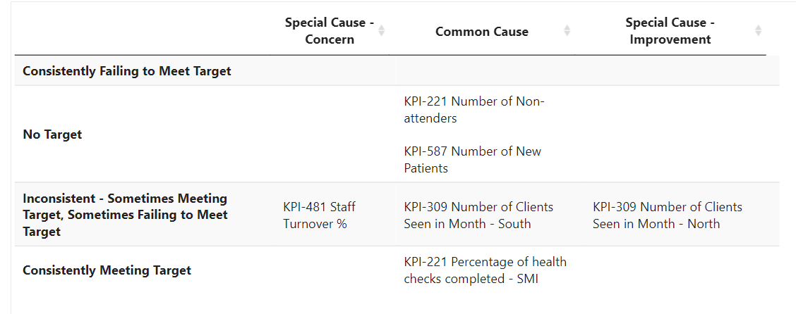

<!-- README.md is generated from README.Rmd. Please edit that file -->

# NHSRplotthedots - a PowerBI Custom Visual Implementation (with many thanks to NHS-R) 

This is a custom visual for PowerBI to allow the generation of
statistical process control (SPC) charts.

All calculations feeding into the visual are powered by R code written
by package is built by the [NHS-R community](https://nhsrcommunity.com)
in the NHSRplotthedots package.

This visual, like the R package, supports the NHSE/I programme [‘Making
Data Count’](https://www.england.nhs.uk/publication/making-data-count/),
and allows users to draw XmR charts, use change points, and apply rules
with summary indicators for when rules are breached.

Please see [‘Making Data Count’
programme](https://www.england.nhs.uk/publication/making-data-count/)
for more details about the precise flavour of XmR used.

> The programme encourages boards, managers, and analyst teams to
> present data in ways that show change over time, and drive better
> understanding of indicators than ‘RAG’ (red, amber, green) rated board
> reports often present.

-   NHS R plot the dots

# NHS-R links

# Using the PowerBI custom visual

The PowerBI visual itself can be downloaded from the **dist/** folder.
Save the .pbix file in there to any location on your computer.

The PowerBI custom visual can then be imported into PowerBI using the
option ‘more visuals’ –&gt; ‘From my files’.

The visual will work when publishing to the PowerBI service.

At present, the following fields are available to populate.

| Field Name                | What is this?                                                               | Notes                                                                                                                                                                                                                 | Example value                           |
|---------------------------|-----------------------------------------------------------------------------|-----------------------------------------------------------------------------------------------------------------------------------------------------------------------------------------------------------------------|-----------------------------------------|
| Values (y axis)           | Values for each week of data.                                               | One of two mandatory fields. If your value is a percentage stored as a decimal between 0 and 1, you can toggle percentage view in the ‘SPC settings’ of the Power BI visual.                                          | 14                                      |
| Dates (x axis)            | Column containing dates.                                                    | Ideally in the format ‘yyyy-mm-dd’ or formatted as a PowerBI date column. May work with ‘dd-mm-yyyy’ but behaviour could be more erratic.                                                                             | 2021-05-31                              |
| Identifier- e.g. KPI Name | Column containing a name that distinguishes separate measures.              | Optional for single graph and KPI. If passed, will be used to set the default title. Mandatory for KPI matrix and KPI summary table.                                                                                  | KPI-309 Number of Clients Seen in Month |
| Improvement Direction     | Column containing target value for improvement direction.                   | OPTIONAL (defaults to ‘increase’ if not provided). Must contain the same value for every row for a single KPI. Can also be manually set in ‘SPC options’ within Power BI visual options for single graph or KPI card. | increase                                |
| Target                    | Column containing target value for KPI.                                     | OPTIONAL. Must contain the same value for every row for a single KPI. Can also be manually set in ‘SPC options’ within Power BI visual options for single graph or KPI card.                                          | 30                                      |
| Recalculation Points      | Column indicating where to rebase the control limits                        | Will look for ‘Y’, ‘Yes’, ‘YES’ or ‘y’ (quotation marks not required)                                                                                                                                                 | y                                       |
| Annotations               | *Not yet in use*                                                            |                                                                                                                                                                                                                       | Remodelled system                       |
| Baseline Duration         | Column providing a different duration to use when calculating the baseline. | Must contain the same value in every row.                                                                                                                                                                             | 15                                      |

Example datasets are given in **sample\_datasets/**

A csv template is given in **template\_dataset/**

An example PowerBI file is available in **pbi\_example\_file/**

One imported, the visual should appear in your list of available
visuals. Click on the icon to add a blank visual to the page. With the
visual selected, drag all fields from your dataset into the relevant
sections.

At this stage, if you have more than one KPI in your dataset, you should
filter the dataset down to a single KPI using the built-in power BI
filters or a slicer to allow users to filter the KPI themselves.

The plot title and size, y axis title and x axis title can be set using
the ‘visual’ options. These changes will all be rendered using plotly.

Some additional options are available from PowerBI by clicking on
‘general’ within this menu. Depending on your version of PowerBI this
will allow you to add extra titles, subtitles, a heading colour and an
outline.

## KPI Card

From the ‘Output Options’, select ‘Card’ to get a KPI card like the one
below.

Various options exist to allow you to tweak the positioning of the MDC
icons.

## KPI Matrix

If passing multiple KPIs, from the ‘Output Options’ select ‘Summary
Matrix’ to get a table like the one below.

This quickly summarises multiple KPIs, with the KPIs in the top left
corner generally being of most concern to decision-makers.

## KPI Summary Table

If passing multiple KPIs, from the ‘Output Options’ select ‘Summary
Table’ to get a table like the one below.

A second type of summary table is also available.

*Note that tables may display smaller than the space allowed for them when editing in PowerBI desktop. Better use of the space will be made when the report is published to the PowerBI service.*

## Faceted Graph

If passing multiple KPIs, from the ‘Output Options’ select ‘Faceted
Graph’ to get a graph like the one below. The number of rows can be
edited.

# Limitations

Due to the nature of R-powered visuals, there is a speed penalty compared to a fully native visual. The visual will take some time to load. Multiple visuals on the same page will slow loading down further - try to limit the number of visuals per page. 

The visual manually needs to be updated when the NHS-R making data count package is published - therefore, the most recent features and bugfixes from that visual may not be available.

# Additional features

## Filtering

The visual works with inbuilt PowerBI filtering options. 

## Zero padding

An option to zero-pad values allows for better handling of datasets where missing values for months should be interpreted as 0 rather than skipped in calculations. 

# Known bugs

There is a known bug where 'NA' is appended to titles in faceted plots. This is on the list to be fixed

Sometimes within-graph titles will not appear despite 'title settings - display title?' being ticked. Turning the switch off and back on again tends to fix this.

# Information for Collaborators

## Key parts of the custom PowerBI visual

| File                     | Function                                                                                                                                                                                                   |
|--------------------------|------------------------------------------------------------------------------------------------------------------------------------------------------------------------------------------------------------|
| script.r                 | The main R script that ingests the data then creates and saves the plotly visual. Additional settings specified in settings.ts and capabilities.json will need to be referenced in here to have an effect. |
| pbiviz.json              | Version numbers are updated in here.                                                                                                                                                                       |
| capabilities.json        | Used when adding additional options to the PowerBI visualisation customisation panel                                                                                                                       |
| src/settings.ts          | Used when adding additional options to the PowerBI visualisation customisation panel                                                                                                                       |
| r\_files/flatten\_HTML.r | Helper functions generated automatically by PBI viz tools when using the RHTML template. References by script.r                                                                                            |

## Setting up development environment to build from source

A full tutorial will be written up at a later date.

In the meantime, details on setting up the required packages were
obtained from the following tutorials:

<https://medium.com/@thakurshalabh/create-dynamic-custom-visual-in-power-bi-using-r-ggplot2-and-plotly-4b15a73ef506>

It’s important to note that (as of June 2023) there is an error with the
most recent version of `powerbi-visuals-tools` has a bug that means that
compiled visuals will just render as blank.

Instead, when you reach this step in the tutorial, use the following to
get the most recent working version:

    npm i -g powerbi-visuals-tools@4.0.5

The following page should be consulted to see which versions of R
packages are currently suppported on the PowerBI service.
<https://learn.microsoft.com/en-us/power-bi/connect-data/service-r-packages-support>

## How to tweak the plotly implementation

The file `script.R` in the root folder is the key file for the plotly
implementation of this.

All underlying R functions from the NHS R Plot the Dots package are
stored in the R folder.

## How to add additional PowerBI visual formatting options

A full tutorial will follow, but for now this excellent and in-depth
tutorial from Stéphane Laurent will get you started:
<https://laustep.github.io/stlahblog/posts/pbiviz.html#adding-formatting-objects>

# 
